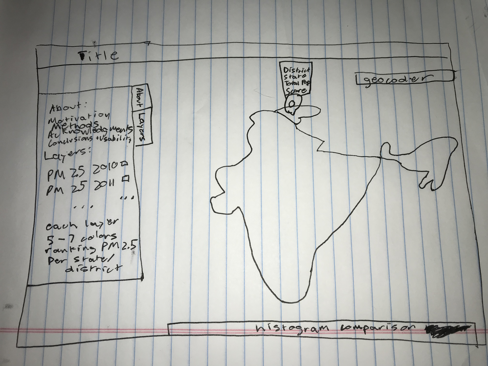
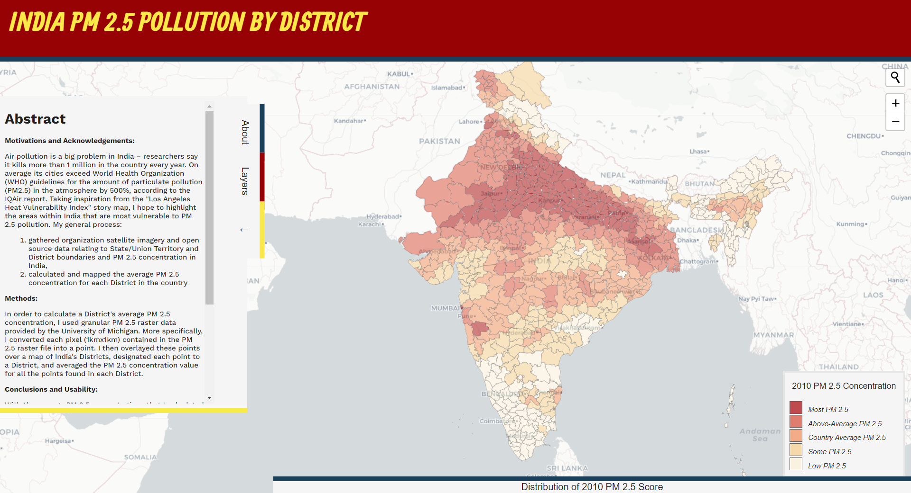

# India-PM-2.5-Pollution-Project

## Project Proposal
**by Aidan Cole**

For this project, I will be generating a website that illustrates the spatial
and temporal relationship of PM 2.5 concentrations in India. Using satellite
imagery and raster data provided by the University of Michigan, this website
will show the average PM 2.5 concentration for each District of India between the
years 2010 and 2019. The ultimate goal of this website is to show the effect of
PM 2.5 pollution on people's cognition.

## Wireframe

## Final Product

[View my site](https://aidanpcole.github.io/)
